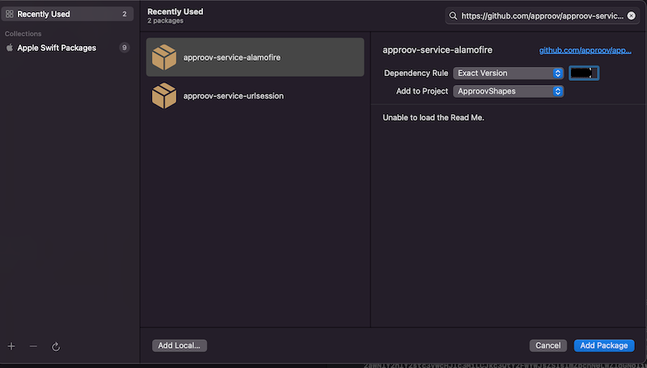

# Approov Quickstart: iOS Swift Moya

[](https://github.com/approov/quickstart-ios-swift-moya/actions/workflows/ios.yml)


Integrate Approov into a Swift iOS app using [Moya](https://github.com/Moya/Moya). Moya uses Alamofire underneath; the Approov Alamofire service provides token injection, dynamic pinning and optional secrets protection and message signing. Follow the [Shapes worked example](SHAPES-EXAMPLE.md) to exercise the integration with an Approov trial or paid account.

## ADDING APPROOV SERVICE DEPENDENCY

Use [Swift Package Manager](https://developer.apple.com/documentation/swift_packages/adding_package_dependencies_to_your_app) in **File → Add Package Dependencies**:

| Repository | Exact version | Product / Swift import |
| --- | --- | --- |
| `https://github.com/approov/approov-service-alamofire.git` | `3.5.6` | `ApproovAFSession` |
| `https://github.com/Moya/Moya.git` | `15.0.3` | `Moya` |



The sample already includes these dependencies. `ApproovSession` is the session **class**; `ApproovAFSession` is the package product and module. The service depends on the closed-source [Approov iOS SDK](https://github.com/approov/approov-ios-sdk) 3.5.3. Commit the application's `Package.resolved` file so CI and local builds use the same transitive versions.

## PROJECT CHANGES

Open `shapes-app/ApproovShapes.xcodeproj` with Xcode 26.4 / Swift 6.4. The checked-in dependency resolution uses Alamofire 5.12.2, which requires iOS 15 and Swift 6.4. The previous iOS 12 / Xcode 16.4 instructions do not apply to this dependency set. Choose your own signing team for physical-device builds.

For the unprotected tutorial baseline, leave `ApproovConfig` in the app's `Info.plist` empty. To enable Approov, set it to your account's SDK configuration and select the protected Shapes endpoint as described in the [tutorial](SHAPES-EXAMPLE.md). Do not commit account-specific configuration or development overrides.

## INITIALIZING APPROOV

Initialize once in `AppDelegate.application(_:didFinishLaunchingWithOptions:)`, before creating a provider. The sample implements this in `ShapesNetworking.initialize(config:)`. A standalone integration should handle both initial setup and fallback explicitly:

```swift
import ApproovAFSession

let correlationID = UUID().uuidString
do {
    try ApproovService.initialize(config: config)
    if ApproovService.isInitialized() && ApproovService.isApproovEnabled() {
        NSLog("Approov enabled; session=%@ device=%@", correlationID,
              ApproovService.getDeviceID() ?? "unavailable")
    } else {
        NSLog("Approov bypass mode; session=%@", correlationID)
    }
} catch {
    NSLog("Approov initialization failed; session=%@", correlationID)
    do {
        try ApproovService.initialize(config: "")
        // Requests now proceed without Approov protection.
        // The backend must reject requests lacking the required proof.
    } catch {
        // Keep networking unavailable and show a recoverable setup error.
        NSLog("Approov bypass setup failed; session=%@", correlationID)
    }
}
```

An empty configuration initializes the service in bypass mode without initializing the native SDK. Check `isApproovEnabled()` before claiming protection is active. Apply substitution, binding or signing configuration **after** initialization, because initialization resets service settings. Never log full tokens, API keys or configuration strings.

## USING MOYA WITH APPROOV

Retain a provider backed by an Approov session, and handle session creation failure:

```swift
import Moya
import ApproovAFSession

// Run only after successful service or bypass initialization.
guard ApproovService.isInitialized(),
      let session = ApproovSession(startRequestsImmediately: false) else {
    // Show a setup error and leave networking unavailable.
    return
}
let provider = MoyaProvider<MyService>(session: session)
```

`startRequestsImmediately: false` lets Moya attach its handlers before starting a request, following [Moya's custom-session guidance](https://github.com/Moya/Moya/blob/master/docs/Providers.md). Keep using this provider for protected targets. See [Moya options](MOYA-OPTIONS.md) for session customization.

Moya can return `.success(Response)` for HTTP errors such as 401, 403 or 500. Check the status code and decode response bodies safely. The sample displays HTTP failures and malformed responses without force-unwrapping server-controlled JSON.

## CHECKING IT WORKS

Start with the [Shapes tutorial](SHAPES-EXAMPLE.md), then run the automated checks and device scenarios in [TESTING.md](TESTING.md). Simulator builds and stubbed responses do not prove real attestation, TLS pinning or backend enforcement.

For account diagnostics, check [Live Metrics](https://approov.io/docs/latest/approov-usage-documentation/#metrics-graphs). An unknown API domain does not receive an Approov token. Seeing requests succeed against an unprotected endpoint is only a connectivity check.

## NEXT STEPS

- [API protection](API-PROTECTION.md): enforce an [Approov token](https://approov.io/docs/latest/approov-usage-documentation/#approov-tokens) at your backend.
- [Secrets protection](SECRETS-PROTECTION.md): replace embedded credentials with Approov-managed secrets. It can be combined with API protection.
- [Reference](REFERENCE.md): the public API for the pinned service version.
- [Moya options](MOYA-OPTIONS.md) and [Alamofire options](https://github.com/approov/approov-service-alamofire/blob/3.5.6/ALAMOFIRE-OPTIONS.md).

This quickstart targets the published 3.5.6 service. The upcoming service migration has a different request/status/signing contract; do not apply those assumptions to this version.
