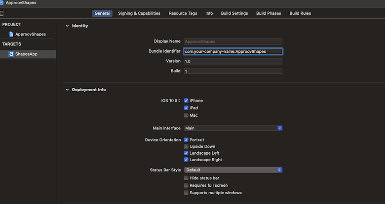
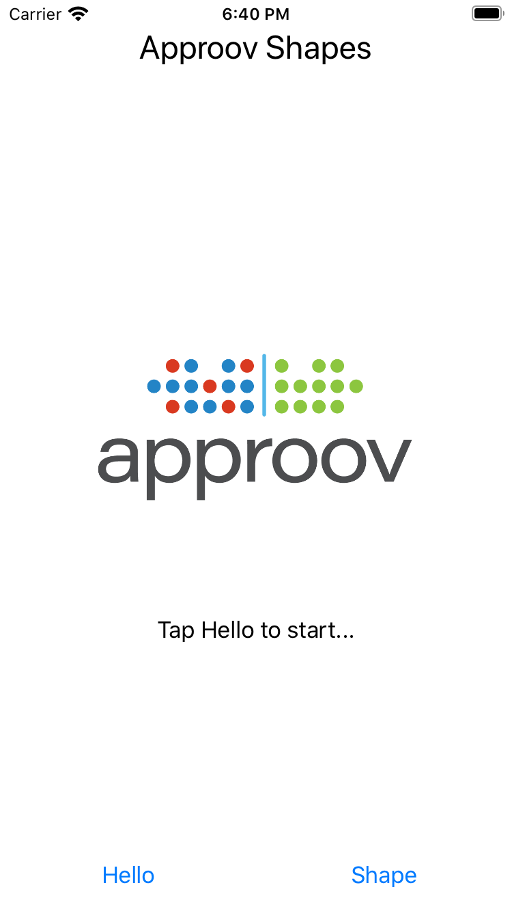
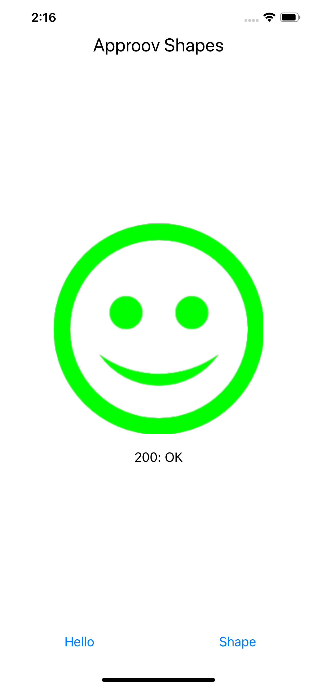
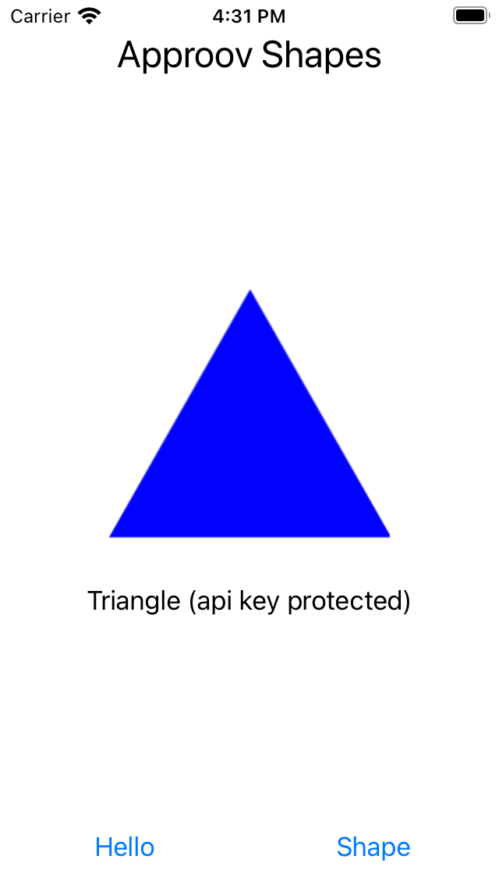
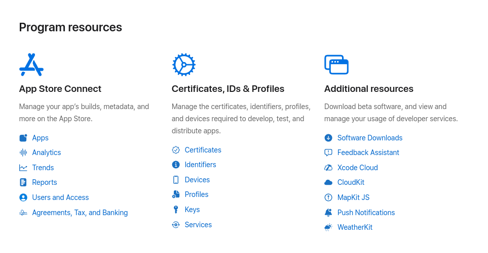
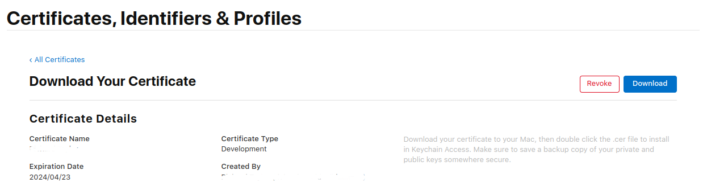
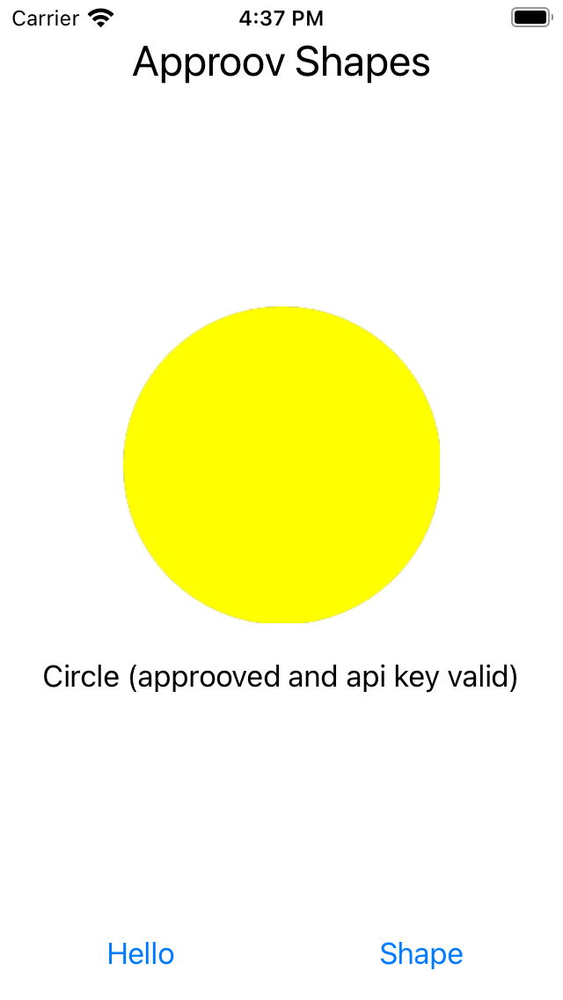

# Shapes Example

This quickstart is written specifically for native iOS apps that are written in Swift and using Moya for making the API calls that you wish to protect with Approov. This quickstart provides a step-by-step example of integrating Approov into an app using a simple `Shapes` example that shows a geometric shape based on a request to an API backend that can be protected with Approov.

## WHAT YOU WILL NEED
* Access to a trial or paid Approov account
* The `approov` command line tool [installed](https://approov.io/docs/latest/approov-installation/) with access to your account
* [Xcode](https://developer.apple.com/xcode/) installed (version 26.4 / Swift 6.4 is used for the checked-in dependency resolution)
* An Apple mobile device or simulator with iOS 15 or higher
* The contents of this repo

## MOYA FRAMEWORK
 
We include [Moya](https://github.com/Moya/Moya) as a `swift package manager` dependency in our project.
 
## RUN THE SHAPES APP WITHOUT APPROOV

Open the `ApproovShapes.xcodeproj` project in the `shapes-app` folder using `File->Open` in Xcode. Ensure the `ApproovShapes` project is selected at the top of Xcode's project explorer panel.

Select your code signing certificate in the `Signing & Capabilities` tab and run the application on your preferred device.



Once the application is running you will see two buttons:

<p>
   
</p>

Click on the `Hello` button and you should see this:

<p>
   
</p>

This checks the connectivity by connecting to the endpoint `https://shapes.approov.io/v1/hello`. Now press the `Shape` button and you will see this (or another shape):

<p>
   
</p>

This contacts `https://shapes.approov.io/v1/shapes` to get the name of a random shape. This endpoint is protected with an API key that is built into the code, and therefore can be easily extracted from the app.

The subsequent steps of this guide show you how to provide better protection, either using an Approov token or by migrating the API key to become an Approov managed secret.

## ADD THE APPROOV SERVICE ALAMOFIRE

The sample already pins `approov-service-alamofire` **3.5.6** and Moya **15.0.3**. Do not add duplicate package references. The SwiftPM product and Swift import are `ApproovAFSession`; the networking class is `ApproovSession`. See [dependency setup](README.md#adding-approov-service-dependency) when integrating into another application.

## ENSURE THE SHAPES API IS ADDED

In order for Approov tokens to be generated for the shapes endpoint `https://shapes.approov.io/v3/shapes` it is necessary to inform Approov about it:

```
approov api -add shapes.approov.io
```

Tokens for this domain will be automatically signed with the specific secret for this domain, rather than the normal one for your account.

## MODIFY THE APP TO USE APPROOV

Set `ApproovConfig` in `shapes-app/ApproovShapes/Info.plist` to your account's SDK configuration string. Do not commit the configured file. The app initializes Approov once in `AppDelegate.swift`; `ShapesNetworking.swift` checks the service state, logs a correlation ID and device ID, and handles initialization failure by entering explicit bypass mode. In bypass mode the backend must reject requests without valid Approov proof.

The sample already passes an `ApproovSession(startRequestsImmediately: false)` to its Moya provider. No import or provider code needs uncommenting.

The sample defines separate `.Shape`, `.ProtectedShape` and `.SignedShape` targets. In `ViewController.swift`, change the Shape button from:

```swift
request(.Shape)
```

to:

```swift
request(.ProtectedShape)
```

The v3 endpoint requires a valid Approov token. Leaving the v1 path selected tests only the public demo API key. The embedded key belongs to the public Shapes demonstration; never embed your production API credentials this way.

## ADD YOUR SIGNING CERTIFICATE TO APPROOV

You should add the signing certificate used to sign apps. These are available in your Apple development account portal. Go to the initial screen showing program resources:



Click on `Certificates` and you will be presented with the full list of development and distribution certificates for the account. Click on the certificate being used to sign applications from your particular Xcode installation and you will be presented with the following dialog:



Now click on the `Download` button and a file with a `.cer` extension is downloaded, e.g. `development.cer`. Add it to Approov with:

```
approov appsigncert -add development.cer -autoReg
```

This ensures that any app signed with the certificate will be recognized by Approov.

If it is not possible to download the correct certificate from the portal then it is also possible to [add app signing certificates from the app](https://approov.io/docs/latest/approov-usage-documentation/#adding-apple-app-signing-certificates-from-app).

> **IMPORTANT:** Apps built to run on the iOS simulator are not code signed and thus auto-registration does not work for them. In this case you can consider [forcing a device ID to pass](https://approov.io/docs/latest/approov-usage-documentation/#forcing-a-device-id-to-pass) to get a valid attestation.

## RUNNING THE SHAPES APP WITH APPROOV

Run the app (without any debugger attached) and press the `Shape` button. You should now see this (or another shape):

<p>
   
</p>

This means that the app is getting a validly signed Approov token to present to the shapes endpoint.

## WHAT IF I DON'T GET SHAPES

If you still don't get a valid shape then there are some things you can try. Remember this may be because the device you are using has some characteristics that cause rejection for the currently set [Security Policy](https://approov.io/docs/latest/approov-usage-documentation/#security-policies) on your account:

* Ensure that the version of the app you are running is signed with the correct certificate.
* Look at the console output from the device using the [Console](https://support.apple.com/en-gb/guide/console/welcome/mac) app from MacOS. This provides console output for a connected simulator or physical device. Select the device and search for `ApproovService` to obtain specific logging related to Approov. This will show lines including the loggable form of any tokens obtained by the app. You can easily [check](https://approov.io/docs/latest/approov-usage-documentation/#loggable-tokens) the validity and find out any reason for a failure.
* Use `approov metrics` to see [Live Metrics](https://approov.io/docs/latest/approov-usage-documentation/#metrics-graphs) of the cause of failure.
* You can use a debugger or simulator and get valid Approov tokens on a specific device by ensuring you are [forcing a device ID to pass](https://approov.io/docs/latest/approov-usage-documentation/#forcing-a-device-id-to-pass). As a shortcut, you can use the `latest` as discussed so that the `device ID` doesn't need to be extracted from the logs or an Approov token.
* Also, you can use a debugger and get valid Approov tokens on any device if you [mark the signing certificate as being for development](https://approov.io/docs/latest/approov-usage-documentation/#development-app-signing-certificates).
* Inspect any exceptions for additional information.

## SHAPES APP WITH INSTALLATION MESSAGE SIGNING

 This section shows how to add message signing as an additional layer of protection in addition to an Approov token.

1. Make sure the Shape button uses the `https://shapes.approov.io/v5/shapes` endpoint. The v5 endpoint performs a message signature check in addition to the Approov token check. Change the button action in `ViewController.swift` to:

```swift
request(.SignedShape)
```

 2. After initialization, enable message signing with the helper in `ShapesNetworking.swift`. It adds the signing service mutator to `ApproovService`:

```swift
//*** UNCOMMENT THE LINES BELOW FOR APPROOV USING INSTALLATION MESSAGE SIGNING
ShapesNetworking.enableInstallationMessageSigning()
```

 3. Configure Approov to add the public message signing key to the approov token. This key is used by the v5 endpoint to perform its message signature check.

 ```shell
 approov policy -setInstallPubKey on
 ```

 4. Build and run the app again and press the `Shape` button. You should see this (or another shape):

 <p>
    
 </p>

 This indicates that in addition to the app obtaining a validly signed Approov token, the message also has a valid signature.

## SHAPES APP WITH SECRETS PROTECTION

This section provides an illustration of an alternative option for Approov protection if you are not able to modify the backend to add an Approov Token check. We are going to be using `https://shapes.approov.io/v1/shapes/` that simply checks for an API key. Change back the code so it points to `https://shapes.approov.io/v1/shapes/`.

```swift
        case .Shape:
            return "v1/shapes"
```

The `Api-Key` header in `MyService.swift` also needs to be changed as follows, removing the actual API key out of the code. Uncomment the line containing `"shapes_api_key_placeholder"` (commenting the previous definition):

```swift
// *** COMMENT IF USING APPROOV SECRETS PROTECTION
                ,"Api-Key" : "yXClypapWNHIifHUWmBIyPFAm"
                // *** UNCOMMENT IF USING APPROOV SECRETS PROTECTION
//                ,"Api-Key" : "shapes_api_key_placeholder"
```

You must inform Approov that it should map `shapes_api_key_placeholder` to `yXClypapWNHIifHUWmBIyPFAm` (the actual API key) in requests as follows:

```
approov secstrings -addKey shapes_api_key_placeholder -predefinedValue yXClypapWNHIifHUWmBIyPFAm
```

> Note that this command requires an [admin role](https://approov.io/docs/latest/approov-usage-documentation/#account-access-roles).

Next we need to inform Approov that it needs to substitute the placeholder value for the real API key on the `Api-Key` header. In `ShapesNetworking.swift`, find the line below and uncomment it after initialization:

```swift
// *** UNCOMMENT IF USING APPROOV SECRETS PROTECTION
ApproovService.addSubstitutionHeader(header: "Api-Key", prefix: nil)
```

This processes the headers and replaces in the actual API key as required.

Build and run the app and press the `Shape` button. You should now see this (or another shape):

<p>
   
</p>

This means that the app is able to access the API key, even though it is no longer embedded in the app code, and provide it to the shapes request.

## RELEASE VALIDATION

Complete [TESTING.md](TESTING.md) before release. Remove force-pass rules and development keys from the test device/account before recording the production-policy result. The screenshots above illustrate the walkthrough; they are not evidence that the current dependency set passed device attestation.
